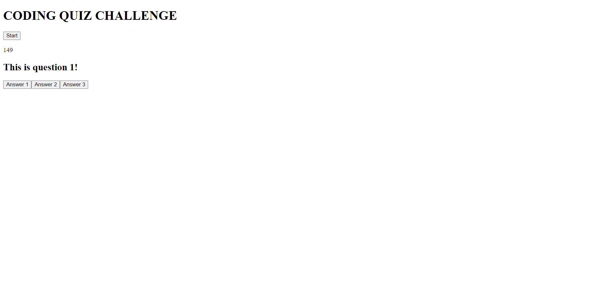

# code-quiz

## Description

A simple Javascript multiple choice quiz that uses a timer that counds down from 175.

## Installation

N/A

## Usage
The user can answer the questions on the quiz while a timer counds down from 175. If they answer incorrectly, the timer will take off 15 seconds. The quiz starts after the user clicks on the "Start" button on the index page.

Dev tools can be used by right clicking on the deployed wepage and clicking inspect. This will show the console to the right. 

## Credits

I worked on this project with the help of a KU tutor.

## License

Please refer to the license in the repo.